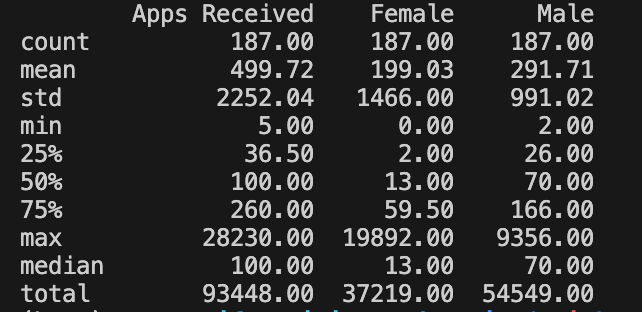
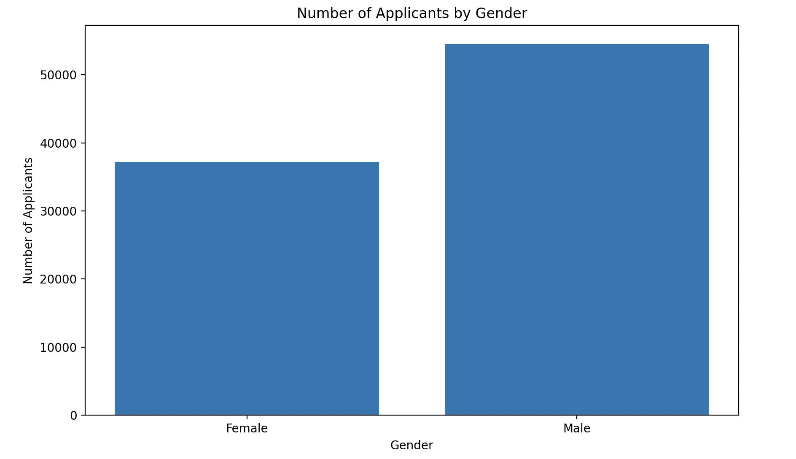

# Mini Project 2: Pandas Script

## Project Purpose
The main purpose of this project is to create Pandas script to analyze the job application data, including generating summary statistics and visualization chart.

## Project Data Source
The project uses the job applicant information provided by United States Government, which includes the number of job applicants by gender. You can find more information about data via link here: https://catalog.data.gov/dataset/?tags=employment&tags=jobs

## Project Key Steps
1. Read job applicant csv file into dataframe.
2. Create a function call "stats_overview" to summarize key statistics, such as count, mean, median, standard deviation, etc.

3. Visualize data using matplotlib.

